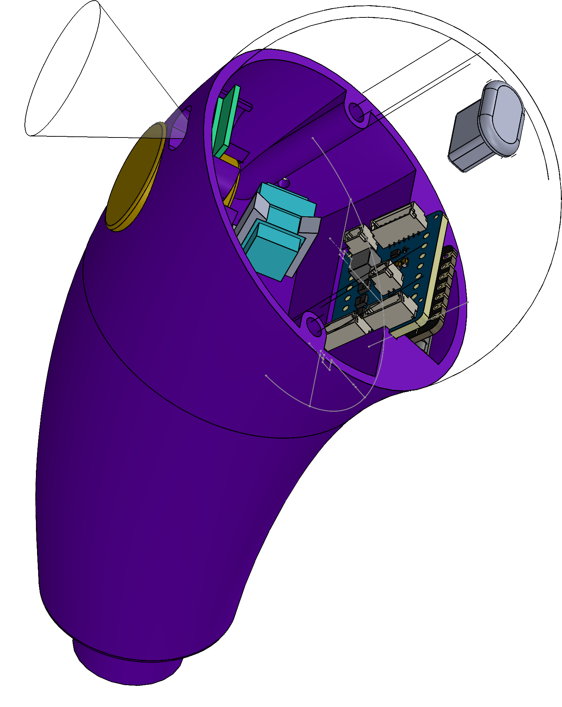
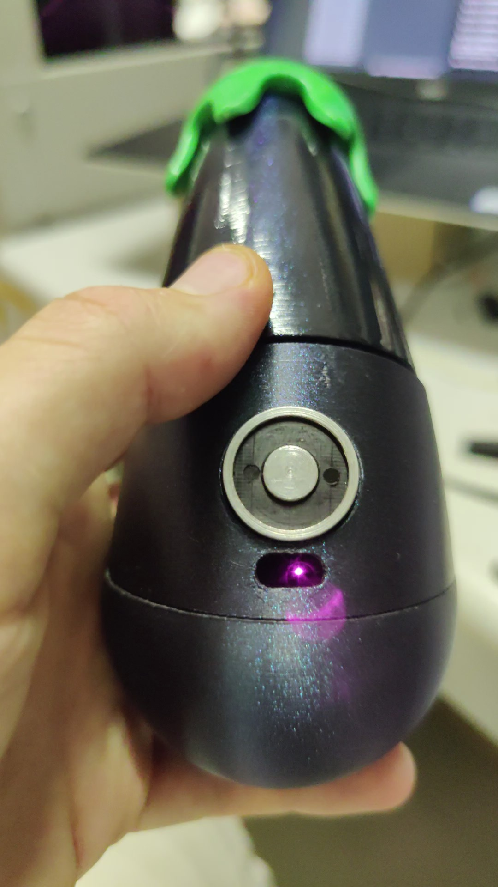
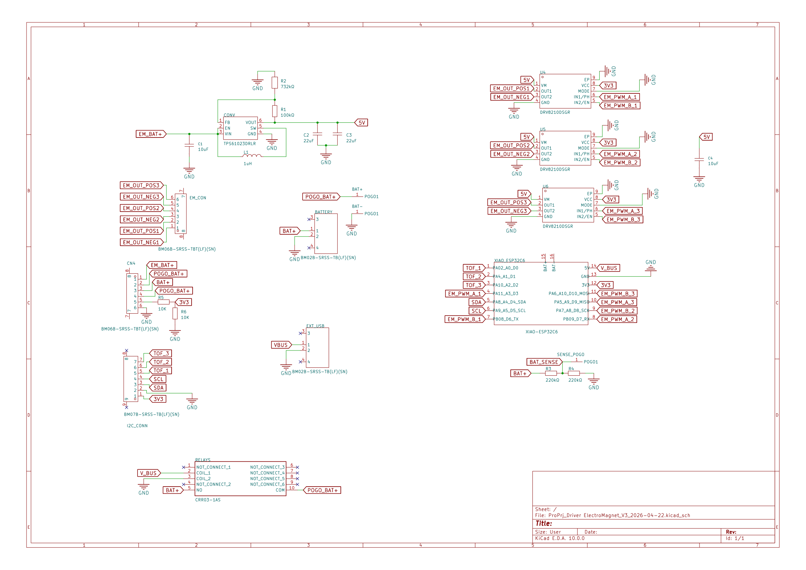

# Rehabilitation Devices for One-Handed Interaction

<p align="center">
     
    
</p>

This project focuses on the design and development of compact rehabilitation devices intended for children who cannot use one hand. The goal is to provide engaging physical objects that help stimulate motor activity and interaction during therapy exercises.

The devices integrate sensing, actuation, and wireless communication in a very compact form factor.

---


## Project Overview

Each device contains:

- **Electromagnets** used for actuation and interaction with the patients  
- **Time-of-Flight (ToF) sensors** to detect the distance from patients  
- A **Seeed Studio XIAO ESP32-C6** microcontroller for control and wireless communication  

The devices communicate wirelessly and interact with a browser-based interface, allowing therapists or developers to monitor and control the system.

---

## Features

- Embedded firmware for **ESP32-C6**
- **Bluetooth Low Energy (BLE)** interface for communication with a JavaScript web application
- **ESP-NOW mesh-style communication** enabling multiple devices to exchange data with each other
- Integration of multiple sensors and electromagnets in a constrained physical space
- Designed for **low-power embedded operation**

---

## System Architecture

The system consists of three main layers.

### Embedded Device

Each device runs firmware on the **XIAO ESP32-C6** that:

- Reads data from ToF sensors  
- Controls electromagnets  
- Communicates with other devices using ESP-NOW  
- Exposes BLE services for external control  

### Device-to-Device Communication

Devices use **ESP-NOW** to exchange messages, enabling cooperative behaviors between multiple rehabilitation objects without requiring a central router.

### Web Interface

A **JavaScript-based interface** connects to the devices through **Bluetooth Low Energy (BLE)** to:

- Monitor device status  
- Send control commands  
- Configure behaviors  

---

## Hardware

Main components:

- **XIAO ESP32-C6**
- **Time-of-Flight (ToF) distance sensors**
- **Electromagnets**
- Custom compact enclosure designed to fit all components

The design focuses on integrating all components into a very small footprint suitable for small handheld objects.

---

## PCB Design

<p align="center">
    
</p> 


A custom PCB was designed to integrate all the electronic components into a compact form factor suitable for the rehabilitation devices.

<p align="center">
    
</p>

The board includes:

- Pass through holes to solder a **Seeed Studio XIAO ESP32-C6**
- Drivers for the **electromagnets**
- Interfaces for **Time-of-Flight (ToF) sensors**
- Power management and protection circuitry
- Connectors for sensors and actuators

The PCB was designed to minimize size while keeping the system reliable and easy to assemble inside the small enclosure used by the devices.

---

## Firmware Responsibilities

The firmware handles:

- Sensor acquisition  
- Electromagnet control  
- BLE communication with the web interface  
- ESP-NOW messaging between devices  
- Resource management for a compact embedded system  

---

## Repository Structure

```
.
├── firmware/
│   └── ESP32-C6 firmware source
│
├── web-interface/
│   └── JavaScript BLE interface
│
├── hardware/
│   └── Hardware integration notes and schematics
```